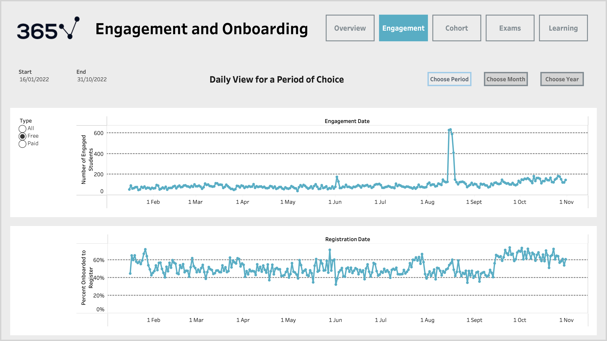
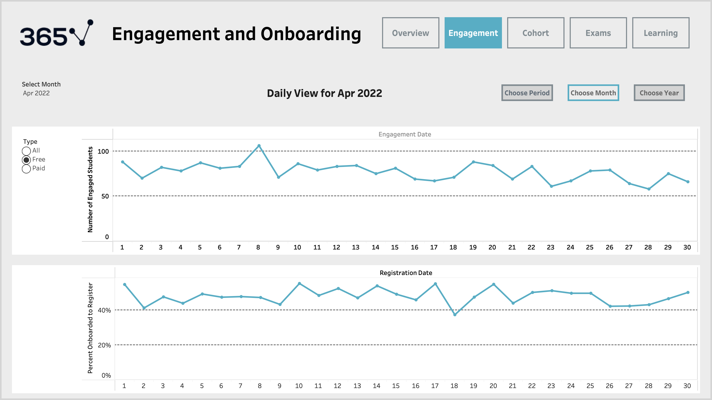
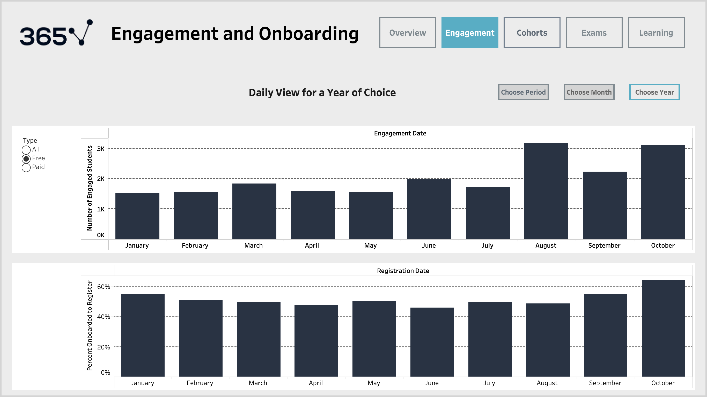
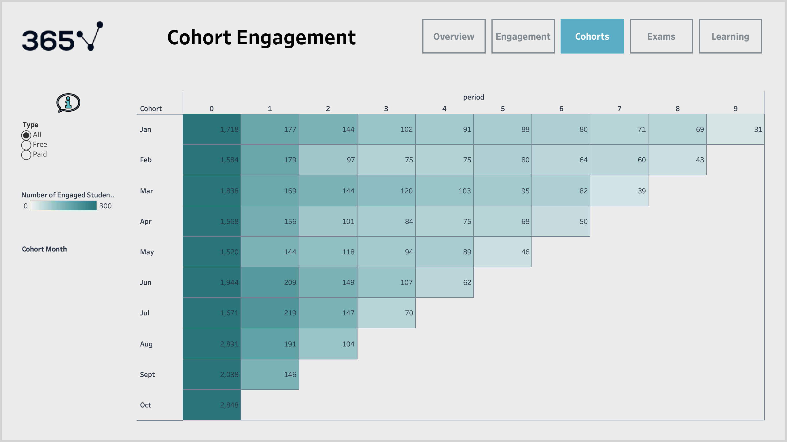
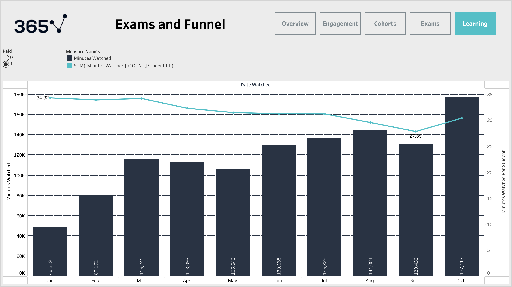

# Learning Platform Product Analytics Dashboard (Tableau)
  Target Role: Product Analyst / Product Analytics

## Project Overview
This project analyzes user behavior across a digital learning platform, focusing on the **product lifecycle from onboarding to engagement, retention, and certification outcomes**.

The goal is to understand:
- How effectively users activate after registration
- How engagement evolves over time
- Where users drop off in learning and exam funnels
- How learning depth and outcomes differ across user segments

This project originally developed as part of a guided Tableau analytics course and significantly extended into an independent, portfolio-ready product analytics case study with custom metrics, insights, and recommendations.

---

## Business Context
The platform offers subscription-based online courses and career tracks.
The core business goals are to:
- Increase user activation after registration
- Improve engagement retention over time
- Drive conversion from learning activity to exams and certifications
- Understand differences between free and paid user behavior

---

## Product Questions Answered
- How many registered users become **actively engaged learners**?
- How does **user retention decay** across cohorts over time?
- Are engagement trends driven by **volume or depth** of learning?
- Where do users drop off in the **career track funnel**?
- How effective are exams and certifications as learning outcomes?
- How does behavior differ between **free and paid users**?

---

## Key Product Metrics
- **Activation Rate**: % of registered users who onboard successfully
- **Engaged Users**: active learners over time (daily/monthly trends)
- **Retention**: cohort engagement by registration month and period
- **Learning Depth**: minutes watched per student
- **Outcome Conversion**: exam → certificate funnel progression
- **Course Performance**: minutes watched, completion rate, ratings

---

## How to Explore This Project

1. Start with the Overview dashboard to understand platform-level KPIs.
2. Review Engagement dashboards to identify activation and usage trends.
3. Analyze Cohort Retention to understand long-term user behavior.
4. Examine Exams & Funnel dashboards to identify outcome drop-offs.
5. Review Learning Behavior to compare depth of engagement between user segments.
6. Read Key Insights and Product Recommendations for business implications.

---

## Dashboards (Screenshots)

### 1) Overview
 

### 2) Engagement Trends




### 3) Cohort Retention


### 4) Exams & Certificates


### 5) Career Track Funnel


### 6) Learning Behavior


---

## Key Insights
- Retention shows a **sharp drop after the first engagement period**, suggesting onboarding friction.
- Engagement growth appears driven more by **user volume than depth of learning**.
- A relatively small fraction of enrolled users complete the **full career track funnel**.
- Paid users show **more stable and sustained engagement patterns** vs free users.
- A visible **engagement spike in August** suggests seasonality or campaign-driven behavior.

---

## Product Recommendations
- Improve onboarding nudges during the **first engagement period** to reduce early churn.
- Add progress reminders and clearer learning milestones before exams.
- Target highly engaged free users with **paid conversion offers**.
- Reduce friction in final exam stages to improve certification completion.
- Investigate seasonal engagement spikes to replicate successful campaigns.

---

## Tools & Skills Used
- Tableau (Dashboards, Parameters, Calculated Fields)
- Product Analytics & KPI Design
- Cohort Retention Analysis
- Funnel Analysis
- User Behavior Analysis
- Data Visualization & Stakeholder Reporting

---

## Repository Structure
```text
learning-platform-product-analytics-tableau/
├── README.md
├── data/
├── tableau/
├── images/
└── docs/
    └── data_dictionary.md
